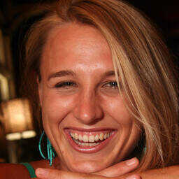
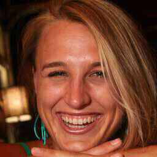
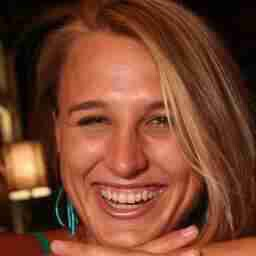
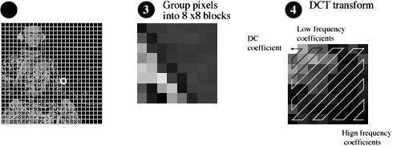
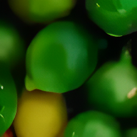
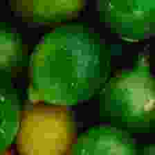
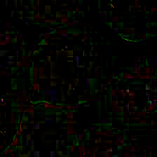

# JPEG Image Compression And Quality Factor Detection

Few methods for JPEG Image Compression And Quality Factor Detection


Low Compression            |  Medium Compression       |  High Compression 
:-------------------------:|:-------------------------:|:-------------------------:
       |        |  


## Methods

### DCT Based JPEG Compression Detection

[Image taken from here](https://www.cs.auckland.ac.nz/compsci708s1c/lectures/jpeg_mpeg/jpeg.html)
<p align="center">
</br>
</p>

* Split the image into 8x8 blocks.
* Compute the DCT coefficients for each block and quantize the frequency components.
* Compute the normalized frequencies across all the blocks.
* Compute the variance of the high frequency blocks.
* If the variance is high, then unclamped high frequency components are present. If the variance is low, then jpeg quanitzed high frequency components are present.
* The above observation can be used to classify if a jpeg image is compressed. 

### Model Based Detection and Regression

Reconstructed Reference    |  Input       |  Residual 
:-------------------------:|:-------------------------:|:-------------------------:
       |        |  


* Compute a reference denoised image using [Real-ESRGAN](https://github.com/xinntao/Real-ESRGAN).
* Compute the residual image, i.e., difference between reference denoised image and input image.
* The residual image contains high-frequency components, artifacts, etc.
* The residual image is passed to a resnet model to get classifcation and regression of jpeg-compression and quality factor respectively.
* The model is trained with augmenting single, doube jpeg compressions.
* Non-aligned double JPEG compression should be implicitly handled as the reference image should produce a constant noise pattern. 


### Pre-Trained Regression Model

* We compute the JPEG Quality Factor using a pretrained regressor, [Towards Flexible Blind JPEG Artifacts Removal (FBCNN, ICCV 2021)](https://arxiv.org/abs/2109.14573) which supports single, doube jpeg compressions with Non-alignment of the quantized matrices in double jpeg compression.
* The [FBCNN](https://github.com/jiaxi-jiang/FBCNN) repository is here.


## Usage

Run get_dataset.sh to download the datasets.

```
bash get_dataset.sh
``` 

### DCT Based JPEG Compression Detection

Execute dct_validation.py to obtain the validation results stored as csv in outputs/dct.csv

```
python3 dct_validation.py
``` 

### Model Based Detection and Regression

Execute validation.py to obtain the validation results stored as csv in outputs/dnn.csv
 
```
python3 validation.py
``` 

### Pre-Trained Regression Model

Execute fbcnn_validation.py to obtain the validation results stored as csv in outputs/fbcnn.csv
 
```
python3 fbcnn_validation.py
``` 

### Train

To train the model, we run train.py

```
python3 train.py
```
